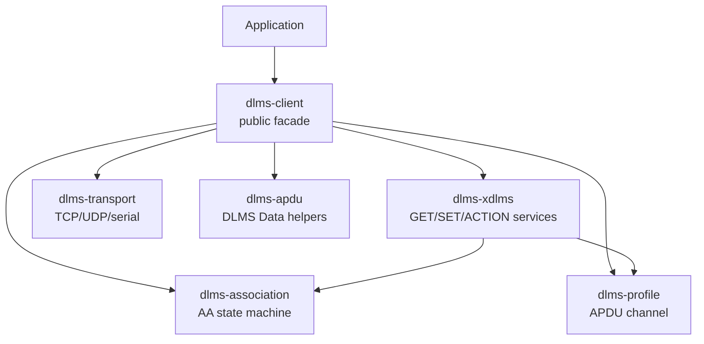
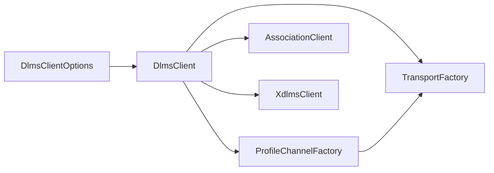
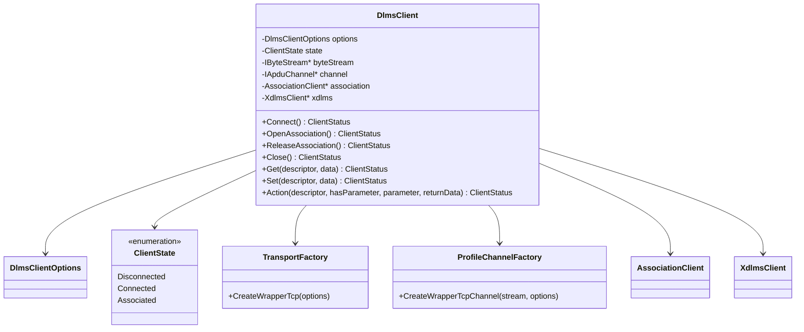
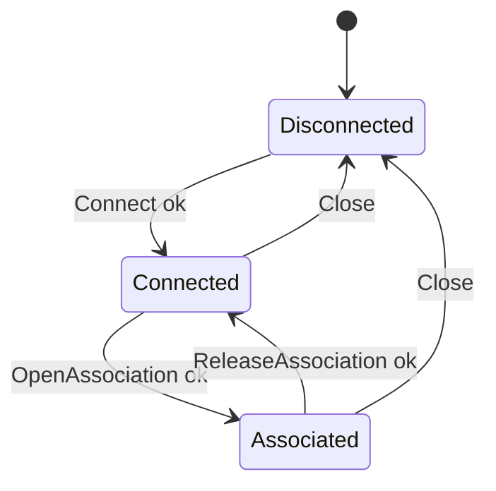

# dlms-client Architecture

## 1. Scope

`dlms-client` is a facade. It owns application ergonomics and lifecycle
composition, not protocol semantics.

## 2. Dependencies

## 3. Public Modules

- `client_status`: facade status enum and string names.
- `client_options`: profile, endpoint, SAP, timeout, and security options.
- `dlms_client`: lifecycle and GET/SET/ACTION facade.
- `client_data`: optional encoded DLMS `Data` helper functions.

## 4. Layer Diagram

## 5. Class Interaction Diagram

## 6. State Machine

## 7. Error Model

Public runtime calls return `ClientStatus`. Constructors only store options and
must not open transports. Destructors may close owned resources best-effort but
must not be the only way to release an association.

## 8. Test Strategy

The first implementation uses fake lower-layer ports for deterministic unit
tests. Real loopback and meter-facing tests belong in root integration or manual
acceptance suites after the facade behavior is stable.
