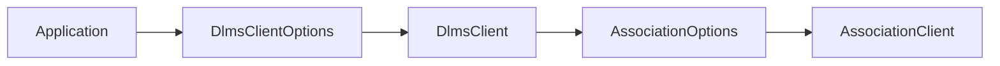
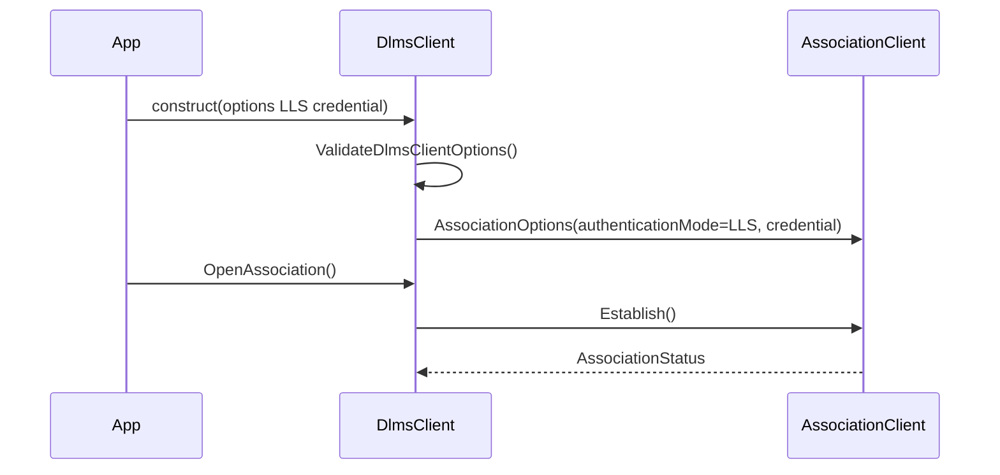

# LLS Options Plan

## 1. Scope

This document defines the `dlms-client` facade increment for Low Level Security
(LLS) association authentication.

`dlms-association` now owns the AARQ ACSE field encoding for LLS. The client
facade shall expose a small options surface that forwards the caller-provided
credential into `AssociationOptions` without changing xDLMS APDU security.

## 2. Requirements

The facade shall:

- add an association authentication option independent from APDU ciphering;
- keep `ClientSecurityMode::None` as the default xDLMS APDU security mode;
- support `ClientAuthenticationMode::None` and
  `ClientAuthenticationMode::LowLevelSecurity`;
- reject LLS when credential pointer is null or size is zero;
- reject credentials too large for the current association LLS encoder;
- pass LLS credential bytes exactly as supplied to `dlms-association`;
- avoid hashing, deriving, storing, or transforming the password;
- keep HLS out of scope until its challenge-response flow is implemented.

The first live target for this phase is Wrapper/TCP client SAP 32 with an LLS
password. Client SAP 48 remains a later HLS phase.

## 3. API Contract

```cpp
enum class ClientAuthenticationMode
{
  None,
  LowLevelSecurity
};

struct ClientLowLevelSecurityOptions
{
  const std::uint8_t* credential;
  std::size_t credentialSize;
};

struct DlmsClientOptions
{
  ClientAuthenticationMode authenticationMode;
  ClientLowLevelSecurityOptions lowLevelSecurity;
  ClientSecurityMode securityMode;
  ...
};
```

The credential memory remains caller-owned and must stay valid for the
constructor call. The options-owned client copies it into the owned
`AssociationClient`.

## 4. Architecture



LLS changes association authentication only. `ClientSecurityMode` continues to
control xDLMS APDU protection through `dlms-security`.

## 5. Class Interaction



## 6. Test Plan

Unit tests shall cover:

- defaults use `ClientAuthenticationMode::None`;
- LLS without credential is invalid;
- LLS with credential validates;
- oversized LLS credential is invalid;
- options-owned client forwards LLS credential into AARQ.

Root follow-up shall extend the opt-in live smoke so client SAP 32 can be
selected with an environment-provided LLS password.

## 7. Implementation Phases

### Phase 46. LLS Client Options Documentation

Deliverables:

- this plan;
- updated requirements, API, architecture, and test plan.

Commit message:

```text
docs(client): define LLS association options
```

### Phase 47. LLS Client Options Implementation

Deliverables:

- public LLS option structs;
- validation;
- association option mapping;
- unit tests for validation and AARQ forwarding.

Commit message:

```text
feat(client): pass LLS credentials to association
```

