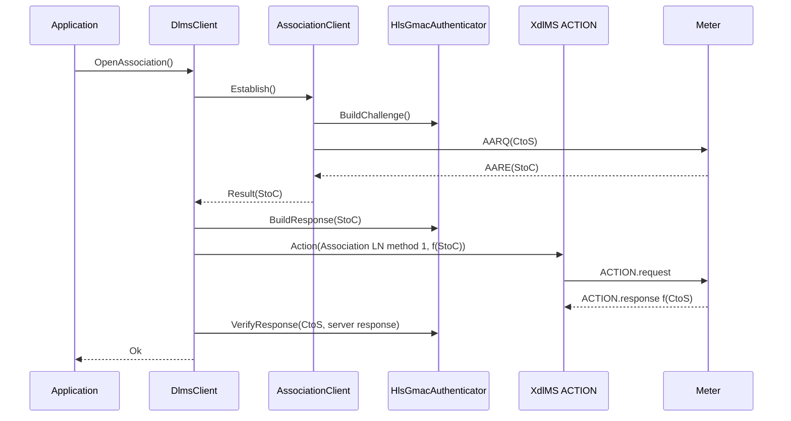

# HLS GMAC Client Options Plan

## 1. Scope

This phase adds client-owned HLS GMAC orchestration to `dlms-client`.

It covers:

- public `ClientAuthenticationMode::HighLevelSecurityGmac`;
- options-owned composition of `dlms-association` HLS strategy callbacks;
- initial client challenge generation through `dlms-security`;
- pass-3 xDLMS ACTION to Association LN `reply_to_HLS_authentication`;
- server pass-4 response verification through `dlms-security`;
- deterministic unit tests with injected fake lower layers and random source
  seams internal to the test build.

It does not cover:

- HLS MD5, SHA-1, SHA-256, ECDSA, or proprietary high-password processing;
- persistent key stores;
- reading invocation counters from the meter;
- automatic Association LN discovery.

## 2. Standards Boundary

HLS is a four-pass process:

1. AARQ carries the client-to-server challenge.
2. AARE carries the server-to-client challenge.
3. The client invokes Association LN `reply_to_HLS_authentication` with
   `f(StoC)`.
4. The server returns `f(CtoS)` and the client verifies it.

For LN referencing, the client uses the Association LN object:

```text
class_id: 15
logical_name: 0.0.40.0.0.255
method_id: 1
```

The ACTION invocation parameter is a complete DLMS `Data` octet-string:

```text
09 <length> <hls_response_bytes>
```

`dlms-client` owns orchestration. `dlms-association` owns AARQ/AARE ACSE
challenge exchange. `dlms-security` owns GMAC challenge generation, response
generation, and response verification.

## 3. Public API

Extend authentication mode:

```cpp
enum class ClientAuthenticationMode
{
  None,
  LowLevelSecurity,
  HighLevelSecurityGmac
};
```

HLS GMAC uses existing `ClientSecurityOptions`:

```cpp
struct ClientSecurityOptions
{
  std::uint8_t clientSystemTitle[8];
  std::uint8_t serverSystemTitle[8];
  std::uint8_t globalUnicastEncryptionKey[16];
  std::uint8_t authenticationKey[16];
  std::uint32_t invocationCounter;
};
```

No password string is added for GMAC. The authentication key is the HLS GMAC
secret material used by `dlms-security`.

## 4. Validation

`ClientAuthenticationMode::HighLevelSecurityGmac` shall require:

- valid non-zero client and server system titles;
- a valid 16-byte authentication key;
- non-zero client and server SAP values;
- a production random source backed by OpenSSL from the MinGW toolchain.

It shall not require APDU ciphering. Association authentication and APDU
protection remain independent. A client may use HLS GMAC authentication with
`ClientSecurityMode::None` until protected application APDUs are explicitly
selected.

## 5. Lifecycle

`OpenAssociation()` shall:

1. call `AssociationClient::Establish()`;
2. for non-HLS modes, mark the client associated as today;
3. for HLS GMAC, read `AssociationResult::highLevelSecurityServerChallenge`;
4. build a GMAC response for the server challenge;
5. send ACTION to Association LN method 1 with that response as a DLMS
   octet-string;
6. verify the returned server response against the original client challenge;
7. mark the client associated only after verification succeeds.

If any HLS pass-3/pass-4 step fails, `OpenAssociation()` returns
`AssociationFailed`, `SecurityFailed`, or the mapped xDLMS service status and
does not mark the facade associated.

## 6. Architecture



## 7. Test Plan

Focused deterministic tests shall cover:

- default options stay `None`;
- HLS GMAC validates system titles and authentication key;
- options-owned client maps HLS GMAC to association `HighLevelSecurity`;
- initial challenge is supplied to association through the strategy;
- after successful AARE, client sends ACTION to class `15`, OBIS
  `0.0.40.0.0.255`, method `1`;
- ACTION parameter is encoded as DLMS octet-string;
- server pass-4 response verification failure maps to `SecurityFailed`;
- ACTION rejection maps through the existing service error model.

Root verification remains:

```text
cmake --build build-mingw64 --target dlms_client_tests
ctest --test-dir build-mingw64 -R "ClientOptions|DlmsClient" --output-on-failure
ctest --test-dir build-mingw64 --output-on-failure
```

## 8. Commit Message

```text
docs(client): define HLS GMAC options
```
