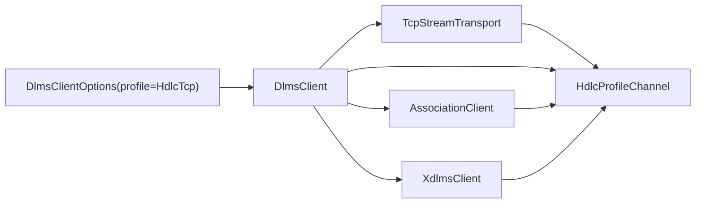
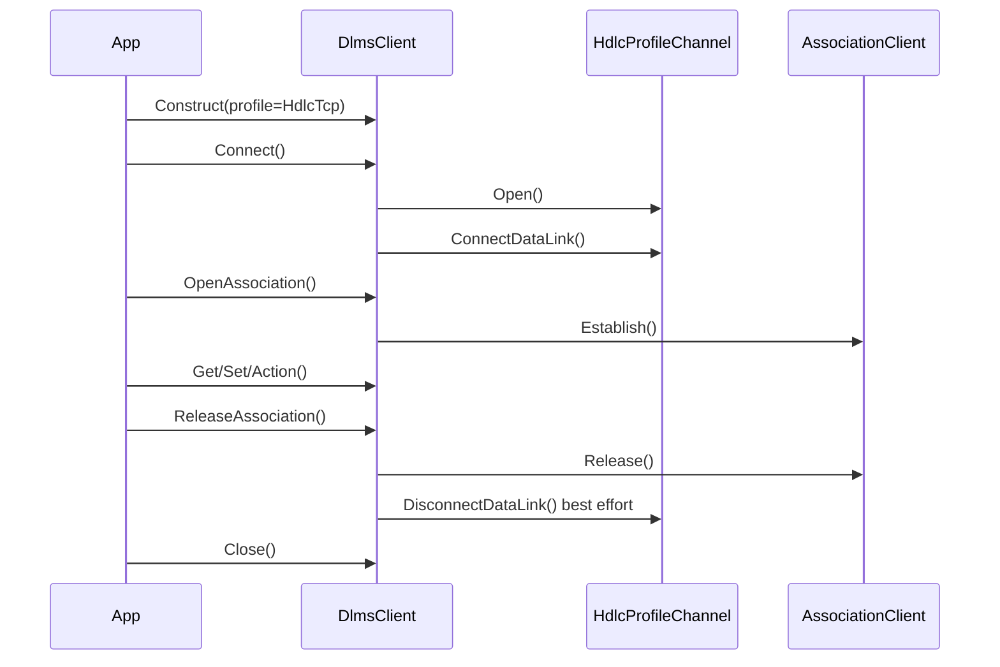

# HDLC/TCP Client Profile Plan

## 1. Scope

This phase extends the options-owned `DlmsClient` constructor with an
HDLC/LLC APDU channel over TCP.

The target stack is:

```text
DlmsClient
  -> AssociationClient
  -> HdlcProfileChannel
  -> TcpStreamTransport
```

This is still a client facade composition phase. HDLC frame encoding, LLC
headers, SNRM/UA session negotiation, retries, and TCP I/O stay in the lower
layers.

## 2. Requirements

1. `ClientProfile` shall support `HdlcTcp` in addition to `WrapperTcp`.
2. `DlmsClientOptions` shall expose HDLC/TCP endpoint options:
   - host;
   - TCP port;
   - client HDLC address;
   - logical device address;
   - physical device address;
   - maximum information field transmit/receive;
   - window size transmit/receive;
   - retry count;
   - retry delay.
3. `DefaultDlmsClientOptions()` shall keep `WrapperTcp` as the default.
4. `ValidateDlmsClientOptions()` shall validate the selected profile only.
5. Options-owned `DlmsClient` construction shall create:
   - `TcpStreamTransport`;
   - `HdlcProfileChannel`;
   - `AssociationClient`;
   - `XdlmsClient`.
6. `Connect()` for HDLC/TCP shall:
   - open the TCP stream through the APDU channel;
   - perform HDLC data-link connect with `ConnectDataLink()`;
   - leave the facade in `Connected` state only after both steps succeed.
7. `ReleaseAssociation()` and `Close()` shall close the HDLC data-link best
   effort through the profile channel before closing the TCP stream.
8. Existing injected-channel constructors shall remain unchanged.

## 3. Non-Goals

- HDLC server facade composition.
- Serial transport.
- HDLC address auto-discovery.
- New retry policy in `dlms-client`.
- Live endpoint assumptions in committed source.

## 4. API Sketch

```cpp
enum class ClientProfile
{
  WrapperTcp,
  HdlcTcp
};

struct HdlcTcpEndpoint
{
  const char* host;
  std::uint16_t port;
  std::uint8_t clientAddress;
  std::uint16_t logicalDeviceAddress;
  std::uint16_t physicalDeviceAddress;
  std::size_t maxInfoTx;
  std::size_t maxInfoRx;
  std::uint8_t windowSizeTx;
  std::uint8_t windowSizeRx;
  std::uint8_t retryCount;
  std::uint32_t retryDelayMs;
};
```

`DlmsClientOptions` keeps the existing `wrapperTcp` field and adds `hdlcTcp`.
Timeouts, client SAP, server SAP, authentication, and security fields remain
shared.

## 5. Architecture





## 6. Test Plan

Unit tests in `dlms-client` shall cover:

- default options remain Wrapper/TCP;
- valid HDLC/TCP options pass validation;
- invalid HDLC/TCP host, port, addresses, information sizes, and window sizes
  fail validation;
- options-owned HDLC/TCP client opens the APDU channel and calls data-link
  connect before reporting `Connected`;
- data-link connect failure maps to `ClientStatus::ChannelOpenFailed` or a
  more specific existing facade status;
- existing Wrapper/TCP tests remain unchanged.

Root integration shall later add an opt-in live smoke mode for
`DLMS_LIVE_PROFILE=hdlc-tcp`.

## 7. Phase Exit Criteria

Documentation phase is complete when this plan and the updated client
requirements/API/architecture/test-plan documents are committed in
`dlms-client`.

Implementation phase is complete when `dlms-client` tests pass, the root
submodule pointer is advanced, and root `ctest` passes.
