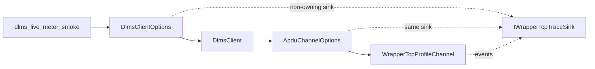
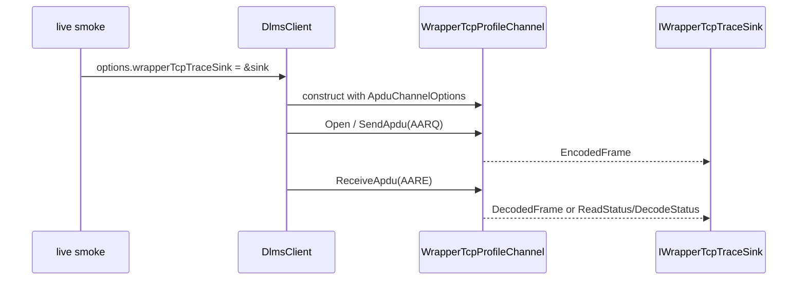

# Wrapper/TCP Trace Plumbing Plan

## Goal

Expose the `dlms-profile` Wrapper/TCP trace hook through `DlmsClientOptions` so
tools that use the high-level client can diagnose live WRAPPER legacy
association failures without manually assembling transport, profile, and
association objects.

The first consumer is the root `dlms_live_meter_smoke` tool.

## Requirements

- Trace is disabled by default.
- Existing client callers must continue to compile without source changes.
- `DlmsClientOptions` owns no trace sink; it stores a nullable non-owning
  pointer supplied by the caller.
- The pointer is forwarded only to the Wrapper/TCP profile path.
- HDLC/TCP behavior remains unchanged.
- Trace events remain defined by `dlms-profile`; `dlms-client` must not invent a
  second trace model.
- The live tool must print metadata only by default and must not print
  passwords, keys, system titles, invocation counters, or full APDU payloads.

## API Sketch

```cpp
#include "dlms/profile/profile_types.hpp"

struct DlmsClientOptions
{
  ...
  dlms::profile::IWrapperTcpTraceSink* wrapperTcpTraceSink;
};
```

`DefaultDlmsClientOptions()` initializes `wrapperTcpTraceSink` to null.

## Architecture





## Test Plan

- `DefaultDlmsClientOptions` leaves `wrapperTcpTraceSink` null.
- Wrapper/TCP client construction forwards the sink to
  `WrapperTcpProfileChannel` so opening association emits an outbound trace
  event.
- HDLC/TCP client construction ignores the Wrapper/TCP sink.
- Root live smoke prints WRAPPER trace metadata when `DLMS_LIVE_TRACE=1`.

## Phase Commit Message

```text
docs(client): define Wrapper TCP trace plumbing

Document how DlmsClientOptions forwards the dlms-profile Wrapper/TCP trace sink
to the WrapperTcpProfileChannel path for live WRAPPER legacy diagnostics. The
plan keeps ownership with the caller, leaves tracing disabled by default, and
limits live output to non-secret metadata.

Verification: documentation-only phase.
```
