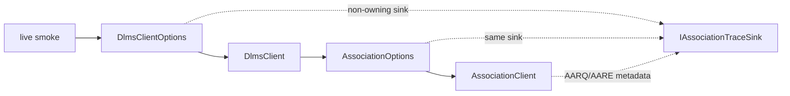

# Association Trace Plumbing Plan

## Goal

Expose the `dlms-association` trace hook through `DlmsClientOptions` so
high-level client users and the root live smoke tool can inspect non-secret
AARQ/AARE metadata without manually constructing an `AssociationClient`.

This complements Wrapper/TCP frame trace. Wrapper trace proves that a WPDU was
written; association trace explains what AARQ metadata was inside that WPDU.

## Requirements

- Trace is disabled by default.
- Existing callers continue to compile without source changes.
- `DlmsClientOptions` stores a nullable non-owning
  `IAssociationTraceSink*`.
- The sink is forwarded unchanged into `AssociationOptions`.
- `dlms-client` does not define a second association trace model.
- Trace output must remain non-secret: no passwords, HLS challenge bytes, keys,
  system titles, invocation counters, or full APDU payloads.

## API Sketch

```cpp
#include "dlms/association/association_types.hpp"

struct DlmsClientOptions
{
  ...
  dlms::association::IAssociationTraceSink* associationTraceSink;
};
```

`DefaultDlmsClientOptions()` initializes the pointer to null.

## Architecture



## Test Plan

- `DefaultDlmsClientOptions` leaves `associationTraceSink` null.
- Options-owned `DlmsClient` forwards the sink into `AssociationClient`, so
  association open emits `AarqBuilt` metadata.
- Existing client tests continue to pass.

## Phase Commit Message

```text
docs(client): define association trace plumbing

Document how DlmsClientOptions forwards the dlms-association trace sink to
AssociationOptions for non-secret AARQ/AARE diagnostics. The plan keeps sink
ownership with the caller and leaves tracing disabled by default.

Verification: documentation-only phase.
```
