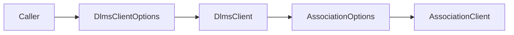

# Association Conformance Options Plan

## 1. Scope

Expose the xDLMS InitiateRequest `proposed-conformance` bitmap through
`DlmsClientOptions`.

The association layer already owns the protocol field. The client facade needs
to forward it so live tools and higher-level clients can match certification
profiles without bypassing `DlmsClient`.

## 2. Requirements

- `DlmsClientOptions` shall expose the association proposed conformance bitmap.
- `DefaultDlmsClientOptions()` shall keep the current effective default by
  copying `DefaultAssociationOptions().proposedConformance`.
- `MakeAssociationOptions()` shall forward the configured bitmap into
  `AssociationOptions::proposedConformance`.
- The option shall not change authentication, ciphering, addressing, or PDU
  size behavior.
- The client shall not validate semantic conformance combinations; the
  association/meter negotiation path owns protocol acceptance.

## 3. API Shape

```cpp
struct DlmsClientOptions
{
  dlms::apdu::AxdrConformance associationProposedConformance;
  std::uint16_t associationClientMaxReceivePduSize;
};
```

## 4. Architecture



## 5. Test Plan

- Verify that default client options expose the association default
  conformance bytes.
- Verify that client option validation still accepts an explicitly configured
  conformance bitmap.
- Run `dlms_client_tests`.

## 6. Commit Message

```text
docs(client): define association conformance option
```
