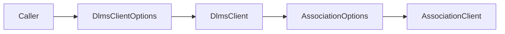

# Association DLMS Version Options Plan

## 1. Scope

Expose the xDLMS InitiateRequest `proposed-dlms-version-number` through
`DlmsClientOptions`.

This is needed for certification-facing tools that probe meter behavior with
non-default version values while still using the normal client stack.

## 2. Requirements

- `DlmsClientOptions` shall expose the association proposed DLMS version
  number.
- `DefaultDlmsClientOptions()` shall keep the current association default.
- `MakeAssociationOptions()` shall forward the configured value into
  `AssociationOptions::proposedDlmsVersionNumber`.
- Validation shall reject zero. Semantic values, including deliberately invalid
  probe values, remain owned by association negotiation and the target meter.
- The option shall not change conformance, PDU size, authentication, or
  transport behavior.

## 3. API Shape

```cpp
struct DlmsClientOptions
{
  std::uint8_t associationProposedDlmsVersionNumber;
  dlms::apdu::AxdrConformance associationProposedConformance;
};
```

## 4. Architecture



## 5. Test Plan

- Verify that default client options expose the association default DLMS
  version.
- Verify that validation accepts a non-zero probe value and rejects zero.
- Run `dlms_client_tests`.

## 6. Commit Message

```text
docs(client): define association DLMS version option
```
