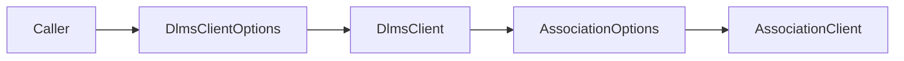

# Association QoS Options Plan

## 1. Scope

Expose the optional xDLMS InitiateRequest `proposed-quality-of-service` field
through `DlmsClientOptions`.

`dlms-association` owns AARQ encoding. The client facade needs to forward this
option so live tools and certification flows can use the normal client stack
for QoS probes.

## 2. Requirements

- `DlmsClientOptions` shall expose QoS presence and value.
- `DefaultDlmsClientOptions()` shall keep the association default: QoS omitted.
- `MakeAssociationOptions()` shall forward QoS presence and value into
  `AssociationOptions`.
- The option shall not affect authentication, security, conformance, DLMS
  version, PDU size, or transport behavior.
- Client validation shall not reject signed QoS probe values. Meter acceptance
  remains an association negotiation result.

## 3. API Shape

```cpp
struct DlmsClientOptions
{
  bool associationHasProposedQualityOfService;
  std::int8_t associationProposedQualityOfService;
};
```

## 4. Architecture



## 5. Test Plan

- Verify default client options omit QoS.
- Verify validation accepts an explicit QoS probe value.
- Run `dlms_client_tests`.

## 6. Commit Message

```text
docs(client): define association QoS option
```
